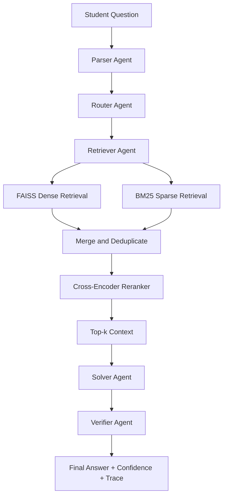

<div align="center">

# 📡 SignalSphere

**A Multi-Agent RAG Tutor for Signals & Systems**

Built with LangGraph, hybrid dense/sparse retrieval, and cross-encoder reranking to deliver grounded, explainable answers instead of single-shot LLM guesses.

[]()
[]()
[]()
[]()

[Overview](#overview) • [Architecture](#architecture) • [Features](#features) • [Installation](#installation) • [Usage](#usage) • [Roadmap](#roadmap)

</div>

---

## Overview


**SignalSphere**  decomposes every question into a pipeline of specialized agents, each with one job: understand the query, retrieve the right context, generate a grounded answer, and verify that the answer is actually supported by the evidence. The result is a modular, auditable RAG system — every response comes with the retrieved sources, a confidence score, and a full trace of how the agents got there.

It's built specifically for **Signals & Systems**, a subject where getting the *wrong* intuitive-but-incorrect answer from a generic chatbot is common and costly for students.


## Features

- 🧩 **Multi-agent architecture** orchestrated with LangGraph — parser, router, retriever, solver, and verifier each run as independent, composable nodes
- 🔍 **Hybrid retrieval** — FAISS dense vector search + BM25 sparse search, merged and deduplicated
- 🎯 **Cross-encoder reranking** (`cross-encoder/ms-marco-MiniLM-L-6-v2`) for high-precision context selection
- ✍️ **Query expansion** to improve recall on short or ambiguous questions
- ✅ **Answer verification agent** that checks generated answers against retrieved evidence and reports a confidence score
- 🧠 **Explainable agent trace** — every step of the reasoning pipeline is logged and inspectable, not a black box
- 🖥️ **Streamlit interface** for interactive use

---

## Architecture



### Agent Responsibilities

| Agent | Responsibility |
|---|---|
| **Parser** | Extracts topic, problem type, and mathematical requirements from the raw question |
| **Router** | Selects the execution path based on parser output (currently: standard retrieval; math-solver path planned) |
| **Retriever** | Runs query expansion, dense (FAISS) and sparse (BM25) retrieval, then merges and deduplicates results |
| **Reranker** | Cross-encoder rescoring of merged candidates to surface the most relevant chunks |
| **Solver** | Generates an educational answer from the top-k reranked context — not a copy-paste of retrieved text |
| **Verifier** | Checks whether the answer is supported by the retrieved evidence and reports a confidence score |

---

## Tech Stack

| Category | Tools |
|---|---|
| Orchestration | LangGraph, LangChain |
| LLM Serving | Ollama (Qwen) |
| Dense Retrieval | SentenceTransformers, FAISS |
| Sparse Retrieval | BM25 |
| Reranking | CrossEncoder (`ms-marco-MiniLM-L-6-v2`) |
| Interface | Streamlit |
| Language | Python 3.10+ |

---

## Project Structure

```
SignalSphere/
├── agents/
│   ├── parser.py         # Query understanding
│   ├── router.py         # Workflow routing
│   ├── retriever.py      # Retrieval orchestration
│   ├── solver.py         # Answer generation
│   ├── verifier.py       # Answer verification
│   ├── graph.py          # LangGraph pipeline definition
│   ├── prompts.py        # Prompt templates
│   ├── states.py         # Shared agent state schema
│   └── utils.py
├── knowledge/
│   ├── vector_store.py    # FAISS index management
│   ├── retriever.py       # Hybrid retrieval logic
│   ├── bm25.py             # Sparse retrieval
│   ├── reranker.py         # Cross-encoder reranking
│   ├── query_expander.py
│   ├── text_documents/     # Source knowledge base
│   └── vector_store/       # Persisted embeddings
├── tools/
├── tests/
├── app.py                 # Streamlit entry point
├── config.py               # Model & retrieval configuration
└── requirements.txt
```

---

## Installation

**Prerequisites:** Python 3.10+, [Ollama](https://ollama.com) installed and running locally with the `qwen3:8b` model pulled.

```bash
# Clone the repository
git clone https://github.com/saber-10/SignalSphere.git
cd SignalSphere

# Install dependencies
pip install -r requirements.txt

# Pull the local model (if not already available)
ollama pull qwen3:8b

# Launch the app
streamlit run app.py
```

The app will be available at `http://localhost:8501`.

---

## Usage

1. Launch the app with `streamlit run app.py`
2. Enter a Signals & Systems question in the text box (e.g. *"Explain the region of convergence for a causal LTI system"*)
3. Click **Ask**
4. Review the response panel:
   - **Answer** — the generated, grounded response
   - **Verification** — whether the answer was verified, and the model's confidence
   - **Parser output** — detected topic, problem type, and retrieval strategy
   - **Retrieved chunks** — the exact source passages used, with rerank scores
   - **Agent trace** — the full step-by-step reasoning path

---

## Configuration

Model and retrieval behavior is controlled in `config.py`:

```python
class Config:
    MODEL = "qwen3:8b"
    TEMPERATURE = 0.2
    TOP_K = 5
```

| Setting | Description |
|---|---|
| `MODEL` | Local Ollama model used for parsing, solving, and verification |
| `TEMPERATURE` | Sampling temperature for generation |
| `TOP_K` | Number of reranked chunks passed to the solver agent |

---

## Roadmap

- [ ] Symbolic math solver agent for closed-form derivations
- [ ] OCR support for handwritten notes and problem sets
- [ ] Circuit diagram understanding
- [ ] Long-term memory across sessions
- [ ] Inline source citations in generated answers
- [ ] PDF upload support for custom study material
- [ ] Automated evaluation suite with accuracy/latency benchmarks
- [ ] Deployed public demo (Streamlit Cloud / Hugging Face Spaces)

---

## Contributing

Contributions, issues, and feature requests are welcome. If you'd like to contribute:

1. Fork the repository
2. Create a feature branch (`git checkout -b feature/your-feature`)
3. Commit your changes
4. Open a pull request

---

## License

This project is licensed under the MIT License. See [LICENSE](LICENSE) for details.

---

## Author

Built by [**saber-10**](https://github.com/saber-10).